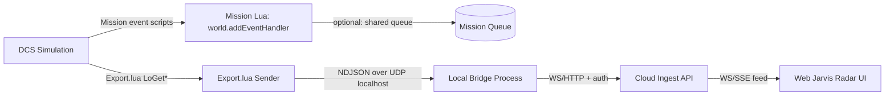

# DCS Contact and Target Data Export for a Jarvis-Style Web Radar

## Executive summary

Building a “Jarvis radar” that shows boogies (air contacts), lock states (STT/TWS), and threat cues (RWR/ECM) is realistic in DCS via Lua export—**but the exact data you can obtain depends heavily on multiplayer export permissions** (“Object / Sensor / Ownship” export categories) and on which aircraft/module you are flying. citeturn24search13turn36view1turn24search6

At a high level, you have three complementary contact sources:

1. **Ownship sensor target list (radar/EOS “what your avionics see”)** via `LoGetTargetInformation()` and `LoGetLockedTargetInformation()`—these provide per-contact kinematics (position matrix, world velocity vector, range, closure, aspect), and flags indicating whether the track is radar/EOS view, lock, TWS track, HOJ, etc. citeturn36view1  
2. **World-object enumeration (“what exists in the mission”)** via `LoGetWorldObjects()` / `LoGetObjectById()`—these provide geo position (lat/long/alt), attitude (heading/pitch/bank), coalition metadata, and some unit state flags (radar on, jamming, human, invisible, etc.), but can be expensive and is often restricted in multiplayer. citeturn36view0turn24search2  
3. **Mission scripting AI detection (“what AI sensors detect”)** via `Controller.getDetectedTargets()` and/or `Controller.isTargetDetected()`—useful for AWACS/EWR-style “picture” feeds and scenario logic; it can also provide last-seen model time and last known position/velocity for targets that are no longer visible. citeturn26view0turn26view1turn26view3  

For a web-hosted Jarvis dashboard (e.g., a front-end deployed on entity["company","Vercel","cloud platform"]), the practical architecture is:

- **DCS Export.lua streams to a local “bridge” process** over UDP/TCP on localhost.
- The bridge process handles auth, buffering, and then forwards to the cloud (WebSocket/HTTP to a realtime gateway you control).
- The browser subscribes and renders radar symbology + advisory logic.

This avoids exposing DCS directly to the internet and stays aligned with DCS export and security constraints. citeturn24search13turn29view0turn24search1  

## Contact and target export surfaces in Export.lua

### Sensor target list and lock states

The core “boogie” APIs most people use for radar-like displays are:

- `LoGetTargetInformation()` → returns **current tracked/reviewed targets** as a table of target records. citeturn36view1  
- `LoGetLockedTargetInformation()` → returns **currently locked targets** (e.g., STT lock, EOS lock; may contain multiple depending on module/context). citeturn36view1  

Each target record includes (key fields):

- `ID` (world object identifier; may be 0 for certain point tracks)  
- `position` as a `Position3` matrix with basis vectors `x/y/z` and point `p={x,y,z}` (center position)  
- `velocity={x,y,z}` in **m/s**  
- `distance` in **meters**, `convergence_velocity` in **m/s**, `mach`, `delta_psi` (aspect rad), `fim/fin` (view angles rad)  
- `flags` bitfield that distinguishes radar/EOS view, lock, TWS track, HOJ, etc.  
- `reflection` (RCS m²), `course` (rad), `isjamming`, `start_of_lock`, `updates_number` citeturn36view1  

That combination is enough to build a fast, responsive B-scope / top-down “radar” view and to derive advisory cues (closure, aspect, lock transitions, jammer indications), even when world-object export is disabled.

### Aircraft-specific “TWS contacts” and RWR/TWS naming confusion

DCS has an export function named `LoGetTWSInfo()`—but in Export.lua documentation this refers to threat-warning/RWR-style “TWS” data (emitters, priorities, etc.), not necessarily radar Track-While-Scan contact lists. citeturn36view1turn2search22  

There is also an aircraft-specific call frequently referenced in the community:

- `LoGetF15_TWS_Contacts()` — as the name implies, it is **F-15 specific**; it appears in the “Sensor”/export function lists and is used by third-party tools that connect to DCS Lua. citeturn2search22turn4search13  

**Key limitation:** `LoGetF15_TWS_Contacts()` is not fully documented in the reference export script text, and its exact return structure is not standardized in official export documentation. The pragmatic approach is to treat it as “best-effort” and instrument it at runtime (e.g., dump keys/types) when you are building your Jarvis integration. citeturn2search22turn4search13turn30view0  

### World objects and metadata

If “Object export” is allowed, you can enumerate objects and/or fetch full metadata:

- `LoGetWorldObjects(arg)` where `arg` can be `"units"` (default), `"ballistic"`, or `"airdromes"`; returned table index is the **object identifier**. citeturn36view0turn36view1  
- `LoGetObjectById(objectId)` returns a rich object table including:
  - `LatLongAlt={Lat,Long,Alt}`
  - `Heading/Pitch/Bank` (radians)
  - `Position={x,y,z}` (DCS internal coordinate system)
  - `Coalition`, `CoalitionID`
  - Unit-only fields `UnitName`, `GroupName`
  - `Flags` such as `RadarActive`, `Human`, `Jamming`, `Invisible`, `Static`, etc. citeturn36view0turn36view1  

A special case: `LoGetSelfData()` returns the same structure as `LoGetObjectById()` **for your own aircraft** and is explicitly documented as not depending on the anti-cheat export setting in `Export/Config.lua`. citeturn36view0  

**Performance warning:** `LoGetWorldObjects()` can become costly in missions with thousands of objects and may reduce FPS/stutter; Tacview’s documentation and community notes highlight this as a known bottleneck because enumerating and copying large Lua tables every frame is expensive. citeturn24search2turn24search6  

## Mission-side contact sources and event hooks

### AI detection “contact lists” from controllers

In mission scripting (not Export.lua), you can query what an AI controller detects:

- `Controller.getDetectedTargets(detectionType1, ...)` returns an array of `DetectedTarget` records with fields:
  - `object` (the detected Object)
  - booleans `visible`, `type` known, `distance` known  
  - Note: documented as applying only to a **Unit controller** (not group level). citeturn26view0turn26view2  

- `Controller.isTargetDetected(target, detectionTypes...)` returns rich “last seen” information:
  - `detected`, `visible`, `lastTime` (ModelTime), `type`, `distance`, `lastPos` (Vec3), `lastVel` (Vec3)  
  - Documented as available at the unit level for all unit types; group-controller caveats exist. citeturn26view1turn26view3  

This is extremely useful for a Jarvis “picture” feed driven by AWACS/EWR or scripted IADS systems, and it provides stable last-seen timestamps you can carry into your radar track state.

### Mission events for “weapon release / hit / takeoff / landing…”

For event-driven snapshots you can register an event handler:

- `world.addEventHandler(handler)` attaches a handler that receives the “event table” whenever a simulator event occurs. citeturn27search16  

Useful events for your radar timeline:

- `S_EVENT_SHOT` (weapon fired; not autocannon) includes `initiator`, `weapon`, and `time`. citeturn27search10  
- `S_EVENT_HIT` (object hit by a weapon) includes `initiator`, `weapon`, `target`, and `time`. citeturn27search0  
- Many others exist (takeoff/land/kill/score/etc.). citeturn27search6turn27search2  

### Zones as “telemetry gates” for training scenarios

If you want “when entering a zone, snapshot contacts / score / guidance,” `trigger.misc.getZone(zoneName)` returns a zone table (`point`, `radius`, etc.) and is commonly used for zone logic in scripts. citeturn23search1turn23search4  

## Multiplayer gating and security constraints

### Export gating: Object vs Sensor vs Ownship

DCS multiplayer can restrict what the client can export. The Hoggit export reference explicitly breaks this into “Object / Sensor / Ownship” categories and encourages checking export permissions before calling the related functions. citeturn24search13turn36view1  

The reference export script exposes helpers:

- `LoIsObjectExportAllowed()`  
- `LoIsSensorExportAllowed()`  
- `LoIsOwnshipExportAllowed()` citeturn1search5turn36view1  

In practice:

- If **Sensor export is disabled**, your `LoGetTargetInformation()` / `LoGetLockedTargetInformation()` feed may be empty or nil.
- If **Object export is disabled**, you may not be able to use `LoGetWorldObjects()` / `LoGetObjectById()` to attach coalition/type metadata or geo coordinates.
- If **Ownship export is disabled**, even ownship-level telemetry may be restricted (implementation varies by server settings). The notable exception is that `LoGetSelfData()` is documented as not depending on an anti-cheat export setting in `Export/Config.lua`, but it can still be indirectly affected by server export policies in some contexts. citeturn36view0turn24search6  

Tacview’s DCS documentation also points out that multiplayer hosts can specify which export data clients are allowed to record/export via the session “Advanced” export options UI. citeturn24search6  

### `net.dostring_in` and “trusted scripts”

If you plan to bridge mission events to export (or vice versa) using `net.dostring_in(state, luaString)`, understand:

- It executes a Lua string in a specified state: `'config'`, `'mission'`, or `'export'`. citeturn32search4  
- Recent DCS release notes explicitly state that behavior changed and that `net.dostring_in()` can be used **only with trusted scripts/missions** (i.e., do not assume it will work everywhere, especially on public MP servers). citeturn21search2turn21search8  

For a Jarvis system intended for wide distribution, this means you should treat `net.dostring_in` as an optional “power feature,” not a required dependency, unless you control the host/server environment.

## Radar contact data model and field mapping

A robust Jarvis radar track should carry more than “position dot on map.” A practical normalized model (usable across aircraft and across the three data sources) is:

```json
{
  "id": "12345",
  "lat": 25.123456,
  "lon": 54.123456,
  "alt_m": 6500,
  "heading_deg": 270.0,
  "speed_mps": 250.0,
  "type": "AIRPLANE_FIGHTER",
  "coalition": "RED",
  "threat_level": 0.75,
  "last_seen_t_model": 1234.56,
  "source_api": "LoGetTargetInformation",
  "confidence": 0.9
}
```

### Field mapping table

| Field | Exact DCS API / Function | Units / Encoding | Typical update frequency | Notes on aircraft / MP availability |
|---|---|---:|---:|---|
| `id` | `LoGetTargetInformation()[i].ID` and `LoGetLockedTargetInformation()[i].ID` | integer object id | 5–20 Hz (sensor) | May be `0` for some point tracks; `flags` indicates tracking mode. citeturn36view1 |
| `id` | `LoGetWorldObjects(...)[objectId]` (table index) | integer object id | 0.2–1 Hz (world) | Returned index documented as “object identifier.” Object export may be disabled in MP. citeturn36view0turn24search13 |
| `id` | `Unit.getObjectID()` (mission scripting) | integer runtime objectID | 1–5 Hz (AI picture) | Useful for correlating AI-detected objects into stable tracks. citeturn35search0 |
| `lat`, `lon`, `alt_m` | `LoGetObjectById(id).LatLongAlt.{Lat,Long,Alt}` | degrees, degrees, meters | 0.2–1 Hz (world) | Requires Object export permission. Provides geo directly. citeturn36view0 |
| `lat`, `lon` | `LoCoordinatesToGeoCoordinates(x,z)` with `LoGetTargetInformation()[i].position.p.{x,z}` | degrees | 5–20 Hz (sensor) | Used when you have internal coords and want geo; function exists in the export API lists even when you can’t enumerate all objects. Exact signature may require validation in your build. citeturn24search13turn36view1 |
| `alt_m` | `LoGetTargetInformation()[i].position.p.y` | meters | 5–20 Hz | Target position matrix `p` is in DCS world coordinates; `y` is altitude in meters in most export usage. Validate per map if you mix AGL/MSL. citeturn36view1 |
| `heading_deg` | `LoGetObjectById(id).Heading` | radians → degrees | 0.2–1 Hz | Object export needed for per-object heading. citeturn36view0 |
| `heading_deg` | `LoGetTargetInformation()[i].course` | radians → degrees | 5–20 Hz | Course is a good “heading proxy” for air targets (but differs in high-G turns). citeturn36view1 |
| `speed_mps` | `LoGetTargetInformation()[i].velocity={x,y,z}` | m/s (vector magnitude) | 5–20 Hz | Direct world velocity vector given for sensor targets. citeturn36view1 |
| `speed_mps` (derived) | `LoGetWorldObjects` / `LoGetObjectById` don’t document velocity fields → compute ΔPosition/Δt | m/s | 0.2–1 Hz | `LoGetObjectById` structure documents `Position` but not velocity; compute using successive samples if needed. citeturn36view0 |
| `type` | `LoGetObjectById(id).Type = {level1..level4}` | wsTypes tuple | 0.2–1 Hz | Map type tuple using `LoGetNameByType(level1..4)` if you need friendly strings. citeturn36view0turn2search22 |
| `type` | `LoGetTargetInformation()[i].type` | wsTypes tuple | 5–20 Hz | Exists in sensor target struct. Aircraft-dependent completeness. citeturn36view1 |
| `coalition` | `LoGetObjectById(id).Coalition / CoalitionID` | enum-like | 0.2–1 Hz | Requires Object export. citeturn36view0 |
| `coalition` | `Object.getCoalition()` (mission scripting) | enum `coalition.side` | 1–5 Hz | Use with AI detection / mission objects. citeturn35search24 |
| `threat_level` (derived) | `LoGetTWSInfo()` (RWR/TWS emitters) + your heuristic | 0–1 float | 2–10 Hz | Use emitter priority/signal strength + range/closure; exact emitter schema is partially module-dependent. citeturn2search22turn36view1 |
| `threat_level` (derived) | `LoGetTargetInformation()[i].flags` (lock/TWS/HOJ bits), `distance`, `convergence_velocity` | heuristic | 5–20 Hz | Flags define radar/EOS view/lock/TWS/HOJ modes (e.g., `0x0008` STT lock, `0x0020` radar TWS track). citeturn36view1 |
| `last_seen_t_model` | `LoGetModelTime()` | seconds (model time) | every frame | Use as authoritative sim timeline; store per track on each update. citeturn2search22 |
| `last_seen_t_model` | `Controller.isTargetDetected(...)->lastTime` | seconds (model time) | 1–5 Hz | Great for AI-based tracks that can drop visibility. citeturn26view1turn26view3 |
| `source_api` | constant string you assign | string | n/a | Useful for debugging and confidence scoring across sources. |
| `confidence` (derived) | `DetectedTarget.visible/type/distance` and `isTargetDetected` outputs | 0–1 float | 1–5 Hz | Mission AI detection exposes whether type/distance are known and whether target is currently visible. citeturn26view0turn26view1turn26view3 |
| `confidence` (derived) | `LoGetTargetInformation()[i].updates_number` + `flags` | 0–1 float | 5–20 Hz | Use radar update count + lock/TWS bits as a proxy for track quality. citeturn36view1 |

## Streaming, sampling, and correlation design

### Recommended sampling rates and batching

A practical “Jarvis radar” live loop typically looks like:

- **Ownship pose + sensor contacts:** 10–20 Hz (smooth enough for UI, not too heavy).  
- **RWR/threat list:** 5–10 Hz (fast enough for spikes/launch cues).  
- **World-object snapshots:** 0.2–1 Hz maximum, and preferably **on-demand** (button press / command), especially in large missions. citeturn24search2turn36view0  

Batching strategies:

- Emit **one NDJSON line per “frame”** containing an array of contacts (cheaper than one UDP packet per contact).  
- Include `t_model` (simulation time) and `t_wall` (wall-clock) so your server/browser can compute latency and reorder/deduplicate cleanly.  
- If bandwidth is tight, downsample far targets or only send deltas (changed tracks) similar to how `dcs-export-core` sends “changed keys” per update. citeturn29view0  

### Track deduplication and correlation

Preferred correlation order:

1. **Use object IDs when present** (`target.ID`, `LoGetWorldObjects` index, `Unit.getObjectID`). These are designed to be unique identifiers. citeturn36view0turn36view1turn35search0  
2. For targets where `ID == 0` (or missing), use a fallback “track key” like quantized `(range, azimuth, elevation)` from target `distance/fim/fin`, and then apply **nearest-neighbor association** across frames. citeturn36view1  

A simple nearest-neighbor approach that works well:

- Maintain `tracks` keyed by `id` when available, else `ephemeral_key`.
- Each update, for unkeyed detections:
  - Predict prior track position using last `velocity` (or last-pos if only AI data).
  - Associate with the nearest predicted position within a gating radius (e.g., 1–3 km depending on dt).
- Remove tracks that exceed a TTL (e.g., 8–15 seconds) unless you want a “memory trail.”

### Latency targets

For “advice” and radar symbology to feel responsive:

- Target **end-to-end latency** (DCS → browser render) of **<200–300 ms** for the “contacts stream.”
- For on-demand full-world snapshots, **<1–2 s** is usually acceptable (since it’s informational and expensive).

### Transport options and security

DCS export supports standard networking using LuaSocket; the export documentation notes DCS ships LuaSocket examples and you can use it for standard network connections from `Export.lua`. citeturn24search13turn30view0  

Common patterns:

- **UDP (localhost)** from DCS to a local bridge: simplest, low overhead, tolerant of minor loss.
- **TCP (localhost)** for command/control (snapshots, mode switches): easier to implement reliable request/response.
- **WebSocket/HTTP** from the local bridge to the cloud: keep auth, rate limiting, and tokens out of the DCS Lua environment.

Security best practices:

- Bind your Export.lua sender to `127.0.0.1` only; never expose a listening socket on `0.0.0.0` from DCS.
- Use an app-level token from local bridge → cloud.
- Treat `net.dostring_in` as privileged: it executes code across Lua states and is subject to “trusted script” constraints. citeturn32search4turn21search2  

### Reference patterns from community exporters

- `dcs-export-core` demonstrates newline-separated JSON messaging and a stable transport pattern (UDP multicast + TCP) with 30 “newdata” messages per second. citeturn29view0  
- DCS-BIOS documents UDP multicast export patterns (e.g., 239.255.50.10:5010 on loopback for its export protocol) and newline-terminated command inputs. citeturn37search4turn37search5  
- Tacview’s real-time telemetry documentation provides a well-defined TCP streaming protocol with handshake, user/pass hash, and sequential telemetry streaming concepts you can emulate in your own bridge. citeturn24search1turn24search6  
- `Skynet-IADS` and MOOSE are useful references for how mission scripts reason about detection and correlated tracks at the scenario layer. citeturn37search2turn37search3turn25search11  

## Minimal code snippets

The snippets below are designed to be **copy-paste** starting points, not full frameworks. They focus on: (1) contacts streaming, (2) safe world-object polling, (3) event-driven snapshots (weapon release/hit + lock changes).

### Data flow diagram



### Export.lua snippet: stream sensor contacts via NDJSON UDP

Place in your **Saved Games** export path (commonly `%USERPROFILE%\Saved Games\DCS\Scripts\Export.lua`). The reference export script explicitly recommends putting modifications in the Saved Games Export.lua. citeturn27search1turn24search13  

```lua
-- Export.lua (minimal NDJSON UDP contacts streamer)
-- Sends: ownship + sensor targets + locked targets (if allowed)
-- Transport: UDP localhost (bridge listens)

local lfs = require("lfs")
package.path  = package.path .. ";.\\LuaSocket\\?.lua"
package.cpath = package.cpath .. ";.\\LuaSocket\\?.dll"
local socket = require("socket")

local UDP_HOST = "127.0.0.1"
local UDP_PORT = 50055

local udp = assert(socket.udp())
udp:settimeout(0)
udp:setpeername(UDP_HOST, UDP_PORT)

local last_send_t = 0.0
local SEND_HZ = 10
local SEND_DT = 1.0 / SEND_HZ

local function json_escape(s)
  s = tostring(s)
  s = s:gsub("\\", "\\\\"):gsub("\"", "\\\""):gsub("\n", "\\n"):gsub("\r", "\\r")
  return s
end

local function json_kv(k, v)
  if v == nil then return nil end
  local t = type(v)
  if t == "number" then
    return "\"" .. k .. "\":" .. string.format("%.6f", v)
  elseif t == "boolean" then
    return "\"" .. k .. "\":" .. (v and "true" or "false")
  else
    return "\"" .. k .. "\":\"" .. json_escape(v) .. "\""
  end
end

local function vec3_to_json(x, y, z)
  return "{\"x\":"..string.format("%.3f", x)..",\"y\":"..string.format("%.3f", y)..",\"z\":"..string.format("%.3f", z).."}"
end

local function contact_from_target(tgt, source_api)
  -- tgt is one element from LoGetTargetInformation / LoGetLockedTargetInformation
  local id = tgt.ID or 0
  local p = tgt.position and tgt.position.p
  local v = tgt.velocity
  local speed = 0.0
  if v then speed = math.sqrt(v.x*v.x + v.y*v.y + v.z*v.z) end

  local parts = {}
  parts[#parts+1] = "\"id\":" .. tostring(id)
  parts[#parts+1] = "\"source_api\":\"" .. source_api .. "\""
  if p then
    parts[#parts+1] = "\"pos\":" .. vec3_to_json(p.x, p.y, p.z)
    parts[#parts+1] = "\"alt_m\":" .. string.format("%.1f", p.y)
  end
  if v then
    parts[#parts+1] = "\"vel\":" .. vec3_to_json(v.x, v.y, v.z)
    parts[#parts+1] = "\"speed_mps\":" .. string.format("%.2f", speed)
  end
  if tgt.distance then parts[#parts+1] = "\"range_m\":" .. string.format("%.1f", tgt.distance) end
  if tgt.convergence_velocity then parts[#parts+1] = "\"closure_mps\":" .. string.format("%.2f", tgt.convergence_velocity) end
  if tgt.course then parts[#parts+1] = "\"course_rad\":" .. string.format("%.6f", tgt.course) end
  if tgt.flags then parts[#parts+1] = "\"flags\": " .. tostring(tgt.flags) end
  if tgt.isjamming ~= nil then parts[#parts+1] = "\"isjamming\":" .. (tgt.isjamming and "true" or "false") end
  if tgt.updates_number then parts[#parts+1] = "\"updates_number\":" .. tostring(tgt.updates_number) end
  return "{" .. table.concat(parts, ",") .. "}"
end

function LuaExportAfterNextFrame()
  local t_model = LoGetModelTime()
  if (t_model - last_send_t) < SEND_DT then return end
  last_send_t = t_model

  -- Export gating checks (nil-safe)
  local sensor_ok = (LoIsSensorExportAllowed and LoIsSensorExportAllowed()) or false
  local own_ok    = (LoIsOwnshipExportAllowed and LoIsOwnshipExportAllowed()) or false

  local own = nil
  if own_ok and LoGetSelfData then own = LoGetSelfData() end

  local targets = {}
  local locked  = {}

  if sensor_ok then
    local t = LoGetTargetInformation and LoGetTargetInformation()
    if t then
      for _, tgt in pairs(t) do
        targets[#targets+1] = contact_from_target(tgt, "LoGetTargetInformation")
      end
    end
    local l = LoGetLockedTargetInformation and LoGetLockedTargetInformation()
    if l then
      for _, tgt in pairs(l) do
        locked[#locked+1] = contact_from_target(tgt, "LoGetLockedTargetInformation")
      end
    end
  end

  local out = {}
  out[#out+1] = "{\"msg_type\":\"jarvis_contacts\""
  out[#out+1] = json_kv("t_model", t_model)
  out[#out+1] = json_kv("t_wall", socket.gettime()) -- wall clock
  out[#out+1] = "\"sensor_ok\":" .. (sensor_ok and "true" or "false")
  out[#out+1] = "\"ownship_ok\":" .. (own_ok and "true" or "false")

  if own and own.LatLongAlt then
    out[#out+1] = "\"ownship\":{\"lat\":"..string.format("%.6f", own.LatLongAlt.Lat)..
      ",\"lon\":"..string.format("%.6f", own.LatLongAlt.Long)..
      ",\"alt_m\":"..string.format("%.1f",  own.LatLongAlt.Alt)..
      ",\"heading_rad\":"..string.format("%.6f", own.Heading or 0)..
      "}"
  end

  out[#out+1] = "\"targets\":[" .. table.concat(targets, ",") .. "]"
  out[#out+1] = "\"locked\":[" .. table.concat(locked,  ",") .. "]"
  out[#out+1] = "}\n"

  udp:send(table.concat(out, ","))
end
```

This snippet is based on the documented structures for `LoGetTargetInformation` / `LoGetLockedTargetInformation` target records and `LoGetSelfData()` ownship object records. citeturn36view1turn36view0  

### Export.lua snippet: safe world-object polling (gating + throttling)

Because `LoGetWorldObjects()` can be expensive, treat it as a low-rate/on-demand feature and always gate on `LoIsObjectExportAllowed()`. citeturn36view0turn24search2  

```lua
-- Add to Export.lua: on-demand world snapshot (0.5 Hz max)
local last_world_snapshot_t = 0.0
local WORLD_MIN_DT = 2.0 -- seconds

function Jarvis_TryWorldSnapshot(max_range_m)
  if not (LoIsObjectExportAllowed and LoIsObjectExportAllowed()) then
    return nil, "object_export_disabled"
  end
  local t_model = LoGetModelTime()
  if (t_model - last_world_snapshot_t) < WORLD_MIN_DT then
    return nil, "rate_limited"
  end
  last_world_snapshot_t = t_model

  local own = LoGetSelfData()
  if not (own and own.Position) then return nil, "no_ownship" end
  local ox, oy, oz = own.Position.x, own.Position.y, own.Position.z

  local objs = LoGetWorldObjects() -- default "units"
  if not objs then return nil, "no_world_objects" end

  local contacts = {}
  for id, o in pairs(objs) do
    if o.Position and o.LatLongAlt then
      local dx = o.Position.x - ox
      local dy = o.Position.y - oy
      local dz = o.Position.z - oz
      local dist = math.sqrt(dx*dx + dy*dy + dz*dz)
      if (not max_range_m) or (dist <= max_range_m) then
        contacts[#contacts+1] = {
          id = id,
          lat = o.LatLongAlt.Lat,
          lon = o.LatLongAlt.Long,
          alt_m = o.LatLongAlt.Alt,
          coalition = o.Coalition,
          heading_rad = o.Heading,
          flags = o.Flags
        }
      end
    end
  end
  return contacts, nil
end
```

The object table fields used (`LatLongAlt`, `Position`, `Coalition`, `Heading`, `Flags`) and the requirement that the `LoGetWorldObjects()` index is an object identifier are all documented in the reference export script. citeturn36view0  

### Export.lua snippet: event-driven snapshots (lock transitions + mission “shot/hit” feed)

#### Lock transition snapshots (pure Export.lua)

You can detect “lock acquired / broke lock” by comparing the locked-target list across frames and emitting an event when the set changes. “Lock mode” is also encoded in target `flags`. citeturn36view1turn27search12  

```lua
-- Add to Export.lua: lock change detection

local last_locked_ids = {}

local function set_from_locked_list(list)
  local s = {}
  for _, t in pairs(list or {}) do
    if t.ID then s[t.ID] = true end
  end
  return s
end

local function set_equal(a, b)
  for k,_ in pairs(a) do if not b[k] then return false end end
  for k,_ in pairs(b) do if not a[k] then return false end end
  return true
end

function Jarvis_CheckLockChange()
  if not (LoIsSensorExportAllowed and LoIsSensorExportAllowed()) then return end
  local locked = LoGetLockedTargetInformation and LoGetLockedTargetInformation()
  if not locked then return end

  local cur = set_from_locked_list(locked)
  if not set_equal(cur, last_locked_ids) then
    last_locked_ids = cur
    -- Emit a compact lock-change message (extend to include target kinematics if desired)
    udp:send("{\"msg_type\":\"jarvis_lock_change\",\"t_model\":"..string.format("%.3f", LoGetModelTime()).."}\n")
  end
end

-- call Jarvis_CheckLockChange() inside LuaExportAfterNextFrame()
```

#### Mission event snapshots (weapon release/hit) + bridge concept

Mission scripts can capture `S_EVENT_SHOT` and `S_EVENT_HIT` and push them into a queue. citeturn27search16turn27search10turn27search0  

The cleanest way to get those mission events into Export.lua **without patching MissionScripting.lua** is usually to run a **gameGUI hook** (Saved Games `Scripts\Hooks\*.lua`) that uses `net.dostring_in('mission', ...)` and `net.dostring_in('export', ...)`. This pattern is used by `dcs-export-core`’s GameGUI loader. citeturn33view0turn34view0turn32search4  

Because `net.dostring_in` is restricted to trusted scripts/missions in newer builds, treat this as optional/controlled-environment functionality. citeturn21search2turn32search4  

## Testing plan for contact accuracy and update rates

A lightweight test plan that catches most “radar export” issues early:

- **Export gating tests (MP/SP):** In a controlled MP server and in SP, log the booleans from `LoIsSensorExportAllowed/LoIsObjectExportAllowed/LoIsOwnshipExportAllowed` and verify your Jarvis bridge behaves correctly when any are false (e.g., sensor-only mode still works). citeturn36view1turn24search6  
- **Contact position sanity checks:** Compare a sampled target’s `range_m` / `closure_mps` and positional movement against the in-cockpit radar/BVR page and/or F10 map where permitted. Use model time stamps (`LoGetModelTime`) to align frames. citeturn36view1turn2search22  
- **Event correlation checks:** Fire an A/A missile and confirm you observe:
  - A `S_EVENT_SHOT` in mission logs
  - A lock-change event (if you lock STT before firing)
  - A later `S_EVENT_HIT` (or `S_EVENT_KILL`) when applicable. citeturn27search10turn27search0turn27search6  
- **Performance regression:** Run one mission with low object count and one “busy” mission; compare sim FPS/frametime with `LoGetWorldObjects()` disabled vs enabled. This validates you are not calling it too frequently. citeturn24search2turn36view0  
- **Wire-level tests:** On the bridge, record received NDJSON lines with timestamps; compute:
  - effective Hz,
  - packet loss (UDP),
  - end-to-end latency to the browser.

This positions you well to iterate from “raw boogies” into Jarvis-style advisories (threat prioritization, intercept cues, “broke lock” callouts, etc.) once the telemetry loop is stable.